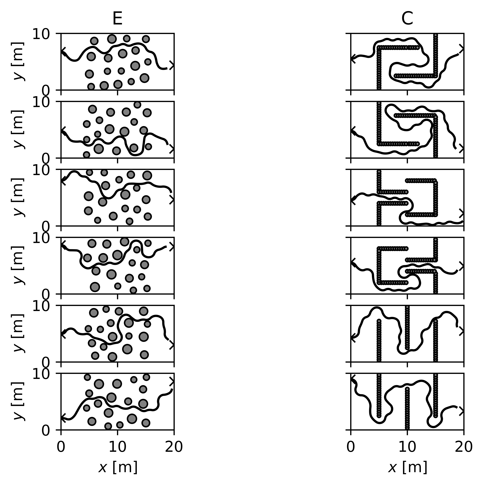

# Dubin's Car
Part of class work(22410) 
## Description
Implement a robotic planning method in order to drive a Dubins car, with the dynamics
```python
x[t+1]     = x[t]     + cos(theta[t])
y[t+1]     = y[t]     + sin(theta[t])
theta[t+1] = theta[t] + tan(phi[t])
```
from an initial position `(x0,y0)` to a target position `(xt, yt)`, while avoiding both collisions with obstacles and venturing out of bounds.

The state variables are:
 - `x`: horizontal position
 - `y`: vertical position
 - `theta`: heading angle (direction of travel)

And, the sole control variable is the steering angle `phi ∈ [-pi/4, pi/4]` (with respect to the direction of travel).




To evaluate the solution run main.py:

```bash
>>> python3 main.py
Grade E: 6/6 cases passed.
Grade C: 6/6 cases passed.
```
